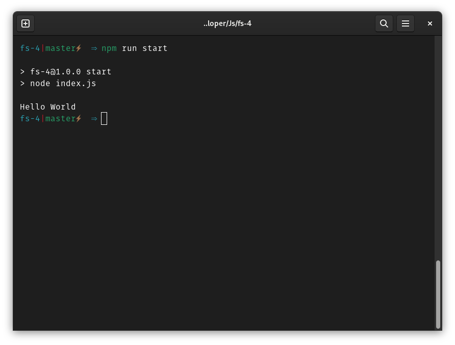

# Hello World

## Requirements

- Working installation of Node.js

## Running

1. Clone this repository (and navigate into it)
2. Run `npm install` to install the dependencies (there are none)
3. Run `npm run start` to start the program
